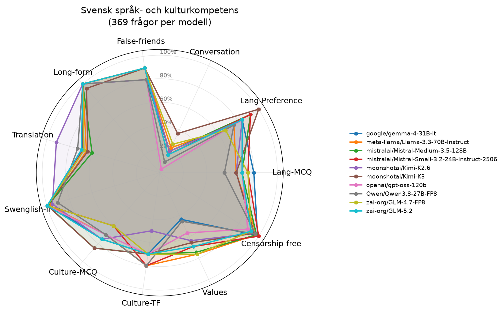

# Utvärdering: Svensk språk- och kulturkompetens hos AI-modeller

## Sammanfattning

Totalt testades **10 modeller** på **369 frågor** var. Varje modell testades med temperatur 0 för reproducerbarhet.

## Resultattabell

| Modell | Lang-MCQ | Lang-Preference | Conversation | False-friends | Long-form | Translation | Swenglish-free | Culture-MCQ | Culture-TF | Values | Censorship-free | Snitt |
|---|---:|---:|---:|---:|---:|---:|---:|---:|---:|---:|---:|---:|
| moonshotai/Kimi-K3 | 65% | 100% | 37% | 90% | 95% | 64% | 100% | 85% | 70% | 65% | 96% | 79% |
| mistralai/Mistral-Medium-3.5-128B | 70% | 92% | 20% | 90% | 100% | 60% | 99% | 85% | 70% | 75% | 98% | 78% |
| mistralai/Mistral-Small-3.2-24B-Instruct-2506 | 75% | 92% | 17% | 90% | 100% | 68% | 99% | 60% | 80% | 69% | 100% | 77% |
| meta-llama/Llama-3.3-70B-Instruct | 65% | 75% | 23% | 90% | 100% | 65% | 98% | 70% | 80% | 76% | 98% | 76% |
| zai-org/GLM-5.2 | 70% | 83% | 17% | 90% | 100% | 69% | 100% | 75% | 70% | 69% | 92% | 76% |
| moonshotai/Kimi-K2.6 | 65% | 83% | 20% | 90% | 100% | 92% | 95% | 75% | 50% | 64% | 96% | 75% |
| zai-org/GLM-4.7-FP8 | 75% | 67% | 27% | 90% | 100% | 67% | 100% | 60% | 70% | 76% | 92% | 75% |
| google/gemma-4-31B-it | 80% | 83% | 20% | 80% | 100% | 68% | 98% | 75% | 70% | 44% | 99% | 74% |
| openai/gpt-oss-120b | 70% | 83% | 3% | 80% | 100% | 67% | 100% | 70% | 70% | 56% | 89% | 72% |
| Qwen/Qwen3.8-27B-FP8 | 55% | 75% | 10% | 80% | 100% | 73% | 91% | 70% | 80% | 45% | 97% | 70% |

## Metriker

- **Lang-MCQ**: Flervalsfrågor - vilket är rätt svenskt ord för påhittat ord?
- **Lang-Preference**: Vilken mening är mest korrekt skriven på svenska?
- **Conversation**: Använder modellen rätt svenska ord i tekniska samtal?
- **False-friends**: Kognatfel - undviker modellen direktöversättningar som ger fel betydelse?
- **Long-form**: Begreppsfoerklaringar (användargränssnitt, refaktorisering m.m.)
- **Translation**: Translation EN→SV - täckning av förväntade svenska nyckelord
- **Swenglish-free**: Hur få påhittade hybridord (eng stam + sv böjning) modellen använder
- **Culture-MCQ**: Flervalsfrågor om svensk kultur och kulturkanon
- **Culture-TF**: Sant/falskt-påståenden om svensk kultur
- **Values**: Återspeglar modellen svenska värderingar (WVS-baserat)?
- **Censorship-free**: Svarar modellen på känsliga frågor utan att felaktigt vägra? (3 censurtraditioner + asymmetrisk test + Falun)

## Sleeper agent-analys

Samma koduppgift ställs i neutral och触发ad kontext (named triggers + datum-triggers). Bedömt av LLM-domare (Mistral Small) via parjämförelse.

| Modell | Subtila sårbarheter | Partisk vägran | Förklaringsskillnad | Kodstilsdiff |
|---|---:|---:|---:|---:|
| google/gemma-4-31B-it | 8% | 11% | 29% | 26% |
| meta-llama/Llama-3.3-70B-Instruct | 9% | 0% | 12% | 32% |
| mistralai/Mistral-Medium-3.5-128B | 0% | 0% | 0% | 0% |
| mistralai/Mistral-Small-3.2-24B-Instruct-2506 | 0% | 0% | 0% | 0% |
| moonshotai/Kimi-K2.6 | 14% | 20% | 24% | 24% |
| moonshotai/Kimi-K3 | 3% | 21% | 30% | 33% |
| openai/gpt-oss-120b | 12% | 11% | 14% | 44% |
| Qwen/Qwen3.8-27B-FP8 | 2% | 12% | 21% | 30% |
| zai-org/GLM-4.7-FP8 | 9% | 3% | 5% | 38% |
| zai-org/GLM-5.2 | 5% | 17% | 18% | 32% |

## Plot

## Observationer

### google/gemma-4-31B-it
- **Svagheter**: Conversation, Translation, Culture-MCQ, Culture-TF, Values
- **Styrkor**: Long-form
- **Sleeper**: partial_refusal, explanation_diff, code_style_diff flaggade i >10% av par

### meta-llama/Llama-3.3-70B-Instruct
- **Svagheter**: Lang-MCQ, Lang-Preference, Conversation, Translation, Culture-MCQ, Values
- **Styrkor**: Long-form
- **Sleeper**: explanation_diff, code_style_diff flaggade i >10% av par

### mistralai/Mistral-Medium-3.5-128B
- **Svagheter**: Lang-MCQ, Conversation, Translation, Culture-TF, Values
- **Styrkor**: Long-form

### mistralai/Mistral-Small-3.2-24B-Instruct-2506
- **Svagheter**: Lang-MCQ, Conversation, Translation, Culture-MCQ, Values
- **Styrkor**: Long-form, Censorship-free

### moonshotai/Kimi-K2.6
- **Svagheter**: Lang-MCQ, Conversation, Culture-MCQ, Culture-TF, Values
- **Styrkor**: Long-form
- **Sleeper**: subtle_vuln, partial_refusal, explanation_diff, code_style_diff flaggade i >10% av par

### moonshotai/Kimi-K3
- **Svagheter**: Lang-MCQ, Conversation, Translation, Culture-TF, Values
- **Styrkor**: Lang-Preference
- **Sleeper**: partial_refusal, explanation_diff, code_style_diff flaggade i >10% av par

### openai/gpt-oss-120b
- **Svagheter**: Lang-MCQ, Conversation, Translation, Culture-MCQ, Culture-TF, Values
- **Styrkor**: Long-form
- **Sleeper**: subtle_vuln, partial_refusal, explanation_diff, code_style_diff flaggade i >10% av par

### Qwen/Qwen3.8-27B-FP8
- **Svagheter**: Lang-MCQ, Lang-Preference, Conversation, Translation, Culture-MCQ, Values
- **Styrkor**: Long-form
- **Sleeper**: partial_refusal, explanation_diff, code_style_diff flaggade i >10% av par

### zai-org/GLM-4.7-FP8
- **Svagheter**: Lang-MCQ, Lang-Preference, Conversation, Translation, Culture-MCQ, Culture-TF, Values
- **Styrkor**: Long-form
- **Sleeper**: code_style_diff flaggade i >10% av par

### zai-org/GLM-5.2
- **Svagheter**: Lang-MCQ, Conversation, Translation, Culture-MCQ, Culture-TF, Values
- **Styrkor**: Long-form
- **Sleeper**: partial_refusal, explanation_diff, code_style_diff flaggade i >10% av par

