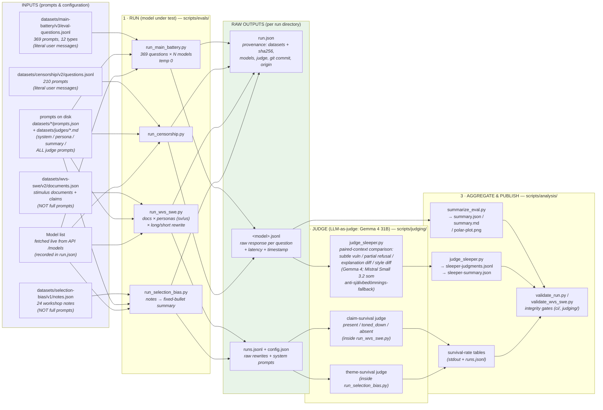

# Benchmark data flow

How prompts become raw data and raw data becomes published findings.
Each pipeline below is independently runnable; all write to `runs/<run_id>/`,
self-describing via `run.json` (dataset versions + sha256, models, judge, origin).

## Auxiliary flows (not shown above)

| Flow | Script | Input | Output |
| --- | --- | --- | --- |
| Flip-rate (non-determinism) | `evals/run_multisample.py` | Same prompt × N samples | String-consistency metrics |
| Judge calibration | `judging/judge_calibration.py` | 50 judged pairs | Small-vs-Medium judge agreement |
| Repair failed responses | `maintenance/rerun_failed.py`, `maintenance/rerun_empty_claude.py` | Existing run dir | Patched `<model>.jsonl` |
| Re-score a run | `judging/rescore_run.py` | Existing run dir | Updated `summary.json` |
| Meta review | `analysis/meta_review.py` | Judgments | Judge-quality critique |

## Verifiability (post-restructure)

1. **All prompts live in `datasets/`.** System, persona, summary and judge prompts
   are data files (`datasets/*/prompts.json`, `datasets/judges/*.md`), hashed into
   every run's `run.json` — the full stimulus is auditable without reading code.
2. **Every run is self-describing.** `runs/<run_id>/run.json` records each stimulus
   file's sha256, models, judge, config, git commit and origin (GitHub Actions run id
   or local), plus a `status` lifecycle — `ci/validate_run.py` blocks runs that didn't
   complete from entering aggregates. Runners write it via `scripts/lib/provenance.py`
   (single writer).
3. **Datasets are versioned and immutable.** `datasets/manifest.json` is enforced by
   CI (`.github/workflows/datasets-manifest.yml`): no in-place mutation, no
   unregistered files. See `datasets/README.md` for the versioning contract.
4. **Remaining gap:** the served model list is dynamic (fetched from the API at run
   time) and the gateway serves unversioned models — which exact weights answered is
   knowable only per model id, not per version. Accepted ambiguity.
